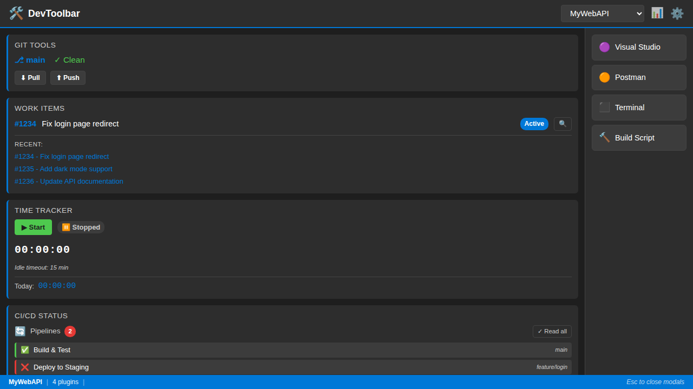
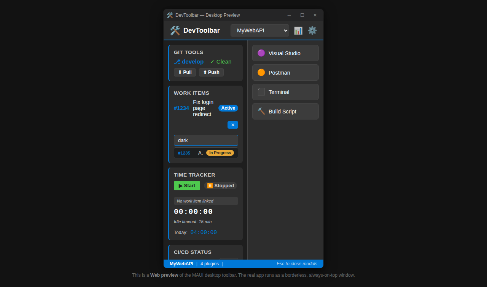
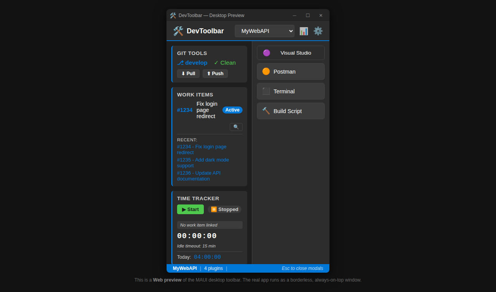
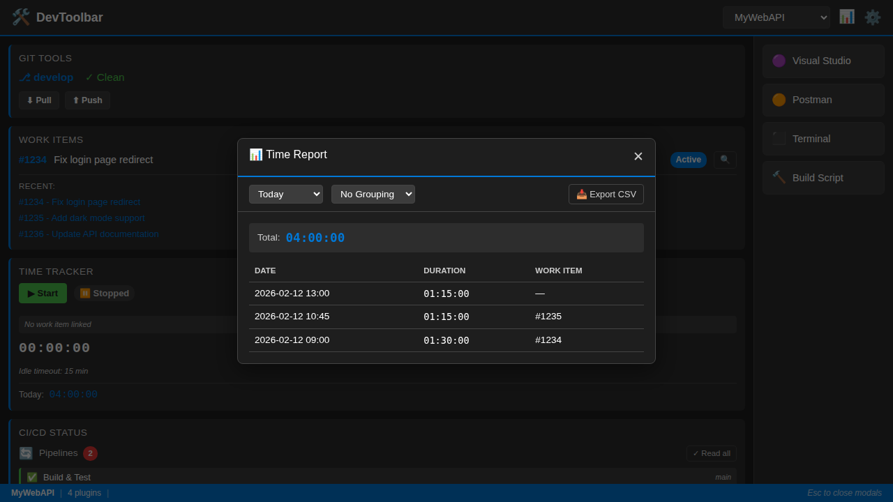
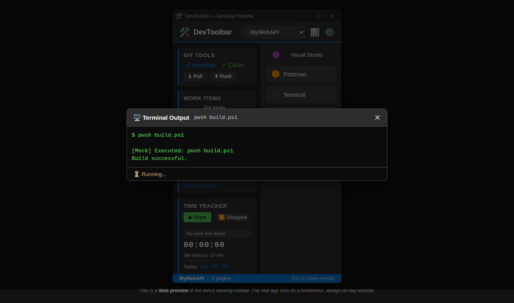
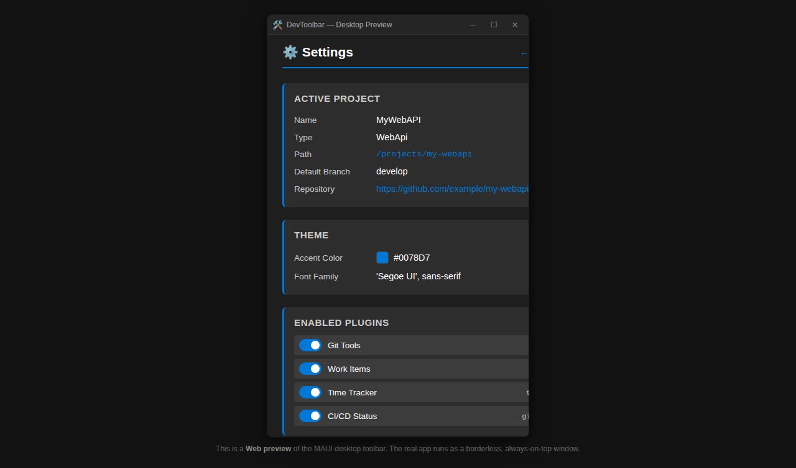
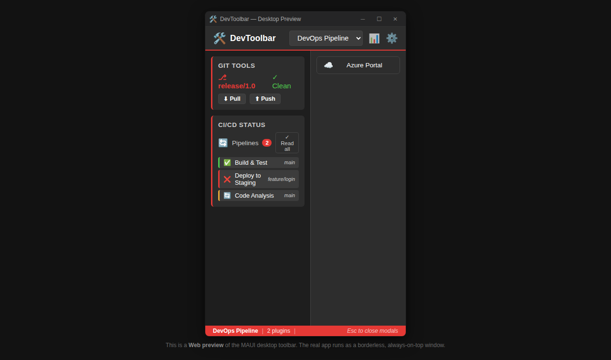
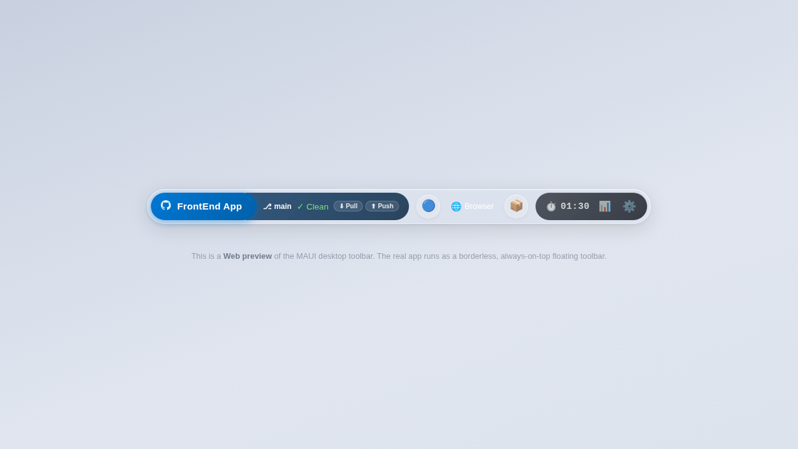

# DevToolbar

A modular developer toolbar built with .NET 10 and Blazor, designed to boost productivity by providing quick access to development tools, project switching, and plugin-based extensibility.

## Architecture

The solution follows a clean architecture with 5 projects:

| Project | Type | Role |
|---------|------|------|
| **DevToolbar.Core** | Class Library | Interfaces, models, events (no UI dependencies) |
| **DevToolbar.UI** | Razor Class Library | Blazor components, layouts, pages, CSS |
| **DevToolbar.Plugins** | Class Library | Plugin implementations (Git, Work Items, Time Tracker, CI/CD) |
| **DevToolbar.Web** | Blazor Web App | Test host with mock services for browser testing |
| **DevToolbar.Maui** | MAUI Blazor Hybrid | Production desktop app (Windows) |
| **DevToolbar.Tests.E2E** | NUnit + Playwright | Automated E2E tests with screenshot capture |

## Screenshots

### Main Toolbar
The toolbar displays all active plugins and quick action buttons for the selected project.


### Git Tools Plugin
Branch display with clean/dirty status and Pull/Push quick sync buttons.



### Work Items Plugin
Active work item display with search/select dropdown.


### Work Items Search
Live search with dropdown filtering to find and select work items.



### Time Tracker Plugin
Start/Stop timer with today's total and idle detection (15 min timeout).


### CI/CD Status Plugin
Pipeline status with unread badge and mark-as-read functionality.


### Action Deck
Configurable quick action buttons for launching processes and scripts.



### Time Report Modal
Day/week/month filtering with CSV export.



### Terminal Output
Script execution with real-time terminal output display.



### Settings Page
Project configuration viewer with plugin toggle switches.



### Project Switching — DevOps Pipeline
Switching projects filters visible plugins and updates actions/theme dynamically.



### Project Switching — FrontEnd App
Each project can have different enabled plugins and action buttons.



## Features

- **Plugin System** — Extensible architecture with `IPlugin` interface
- **Project Switching** — Dynamic context switching with per-project plugin/action/theme configuration
- **Git Tools** — Branch status, Pull/Push quick sync
- **Work Items** — Active item display, dropdown search/select (TFS/GitHub)
- **Time Tracker** — Start/Stop timer, idle detection, today's total
- **Time Reports** — Day/week/month filtering, CSV export
- **CI/CD Status** — Pipeline monitoring, unread badge, mark-as-read
- **Quick Actions** — Process launch, Smart Focus (focus-or-launch), script execution
- **Terminal Output** — Script execution with real-time output modal
- **Dynamic Theming** — Per-project accent colors via CSS variables
- **Toast Notifications** — Action feedback with auto-dismiss
- **Settings Page** — Project overview, plugin toggles, action configuration

## Getting Started

### Prerequisites
- [.NET 10 SDK](https://dotnet.microsoft.com/)
- PowerShell (for Playwright browser installation)

### Build
```bash
dotnet build DevToolbar.slnx
```

### Run Web Test Host
```bash
dotnet run --project src/DevToolbar.Web
```
Then open `http://localhost:5280` in your browser.

### Run E2E Tests
```bash
# Install Playwright browsers (first time only, path may vary by build configuration)
dotnet build tests/DevToolbar.Tests.E2E
pwsh tests/DevToolbar.Tests.E2E/bin/Debug/net10.0/playwright.ps1 install chromium

# Run tests
dotnet test tests/DevToolbar.Tests.E2E
```

### Capture Documentation Screenshots
```bash
dotnet test tests/DevToolbar.Tests.E2E --filter "FullyQualifiedName~ScreenshotTests"
```
Screenshots are saved to `doc/screenshots/`.

## Documentation

- [Features & User Stories](doc/Features.md) — Detailed feature specifications